<div align="center">

# ⚡ Full-Stack Generative AI Platform
### Real-Time LLM Inference with Parameter-Efficient Fine-Tuning

[](https://www.python.org/)
[](https://www.djangoproject.com/)
[](https://reactjs.org/)
[](https://developer.mozilla.org/en-US/docs/Web/API/WebSockets_API)
[](https://mistral.ai/)

<p align="center">
  <a href="#-system-architecture">Architecture</a> •
  <a href="#-current-implementation-collections-officer">Live Demo</a> •
  <a href="#-tech-stack">Tech Stack</a> •
  <a href="#-setup--installation">Installation</a>
</p>

</div>

---

## 📖 Overview

This project represents a **production-ready architecture** for serving open-source Large Language Models (LLMs) locally.

By decoupling the inference engine from the user interface using **WebSockets**, this application achieves real-time, token-by-token streaming similar to ChatGPT, but running entirely on secure, on-premise infrastructure. It leverages **Prefix Tuning (PEFT)** to radically change the model's behavior with minimal compute overhead.

## 💼 Current Implementation: "Collections Officer"

To demonstrate the power of domain-specific fine-tuning, this instance is currently configured as an **Automated Debt Recovery Agent**.

* **The Challenge:** Generic LLMs struggle with specific business protocols like payment negotiation and compliance.
* **The Solution:** The base `Mistral-7B-Instruct-v0.3` model was adapted using a custom dataset (`train_data_fixed.json`).
* **The Result:** A highly specialized agent that:
    * 🛡️ Adheres to a strict "Collections Officer" persona.
    * 💰 Negotiates payment plans and handles debtor objections.
    * ⚡ Responds instantly via the React frontend.

> **Note:** The underlying architecture is agnostic; simply swapping the adapter weights allows this system to become a Medical Assistant, Legal Aide, or Coding Tutor.

---

## 🏗 System Architecture

The system utilizes an asynchronous event loop (Django Channels) to manage persistent connections between the React client and the GPU inference engine.

```mermaid
sequenceDiagram
    participant User
    participant React as ⚛️ React Frontend
    participant Django as 🐍 Django (Daphne)
    participant Model as 🧠 Mistral 7B (PEFT)

    User->>React: Enters Message
    React->>Django: WebSocket Send (JSON)
    Note over Django,Model: Asynchronous Inference
    Django->>Model: Invoke Fine-Tuned Adapter
    loop Token Streaming
        Model-->>Django: Yield Token
        Django-->>React: WebSocket Stream
        React-->>User: Update UI
    end
    Django-->>React: End of Stream

```



## ⚡ Tech Stack

| Component | Technology | Role in System |
| --- | --- | --- |
| **Backend** | **Django + Channels** | Manages WebSocket lifecycle and orchestrates async tasks. |
| **Frontend** | **React + Vite** | Provides a responsive, low-latency chat interface. |
| **AI Engine** | **Hugging Face PEFT** | Loads `Mistral 7B` with lightweight "Prefix Tuning" adapters. |
| **Protocol** | **WebSockets (ASGI)** | Enables bidirectional, real-time communication. |
| **Compute** | **PyTorch / CUDA** | Accelerated GPU inference. |

---

## 📦 Setup & Installation

### 1. Backend Service

The backend handles the heavy lifting of loading the model and managing connections.

```bash
# Clone and enter backend
git clone [https://github.com/your-username/deepseekllm-chatbot-app.git](https://github.com/your-username/deepseekllm-chatbot-app.git)
cd backend

# Environment Setup
python -m venv venv
source venv/bin/activate  # Windows: venv\Scripts\activate
pip install django channels daphne transformers torch peft accelerate

# Run Migration & Start Server
python manage.py migrate
python manage.py runserver

```

*The server will initialize the Mistral 7B model on startup (requires ~16GB VRAM).*

### 2. Frontend Client

A modern React application to interact with the agent.

```bash
cd ../frontend

# Install dependencies
npm install

# Launch Development Server
npm run dev

```

Access the application at `http://localhost:5173`.

---

## 🧠 Fine-Tuning Methodology

We utilize **Prefix Tuning**, a Parameter-Efficient Fine-Tuning (PEFT) technique, to adapt the massive Mistral model without retraining it.

1. **Data Ingestion:** Usage of `backend/chatbot/training/train_data_fixed.json` containing domain-specific dialogue (Collections scenarios).
2. **Training:** The script `backend/chatbot/training/train_prefix.py` freezes the 7B parameters of the base model and optimizes a small set of **20 virtual tokens**.
3. **Inference:** At runtime, these virtual tokens are prepended to user input, effectively "steering" the generic model into the Collections Officer persona with <0.1% added memory cost.

---

<div align="center">

**Created by Rusheel Vijay Sable**
*MSCS Student @ University of Southern California*

[LinkedIn](https://www.google.com/search?q=https://linkedin.com/in/your-linkedin) • [GitHub](https://github.com/your-github)

</div>

